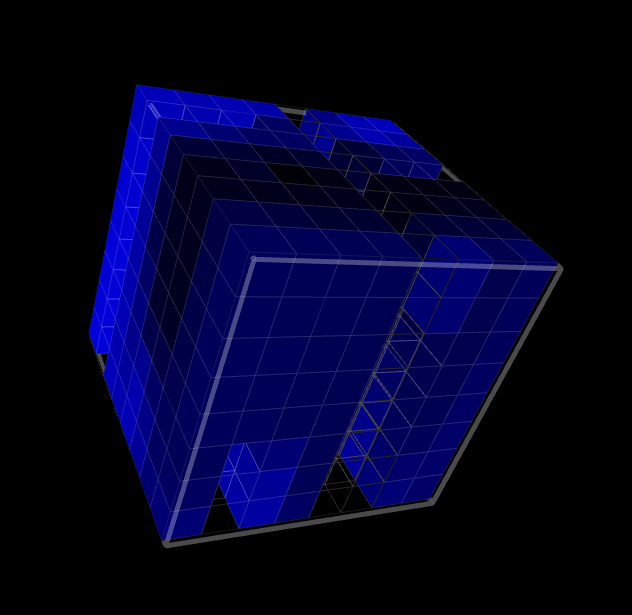

# lakebrite-temp-viz

This is a Processing simulation of Lake Champlain water temperature data visualized on an 8x8 LED cube. It was built for the Code for Burlington Brigade as part of the [National Day of Civic Hacking](http://codeforbtv.org/events/2015/06/national-day-of-civic-hacking/).

The axes on the cube are:
- 8 Stations arranged north to south.
- 8 months back in time.
- 8 increments deep (lake depth).

The color represents temperature. Darker blues are colder. Note that data is missing for some time periods and is entirely missing for one station.

Data was provided by [this python data munger](https://github.com/mattparrilla/l3d-cubes).

## Installation

1. [Download Processing](https://www.processing.org/download/)
2. [Download the L3D cube library](https://github.com/enjrolas/L3D-library)
3. Place the L3D cube library in `Documents/Processing/libraries/`
4. Place the `LakebriteTempViz` folder from this repository in `Documents/Processing/libraries/L3D/examples/`
5. Open the Processing application.
6. Go to `File` > `Examples...` and expand `Contributed Libraries` > `L3D Cube library`. Double-click `LakebriteTempViz` to open the project.
7. Click the Run button in the Processing Sketch.
